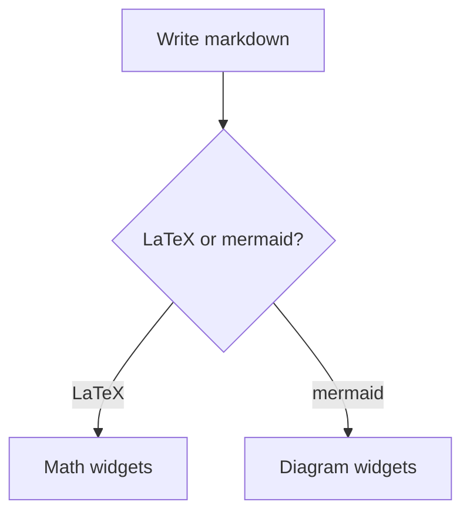
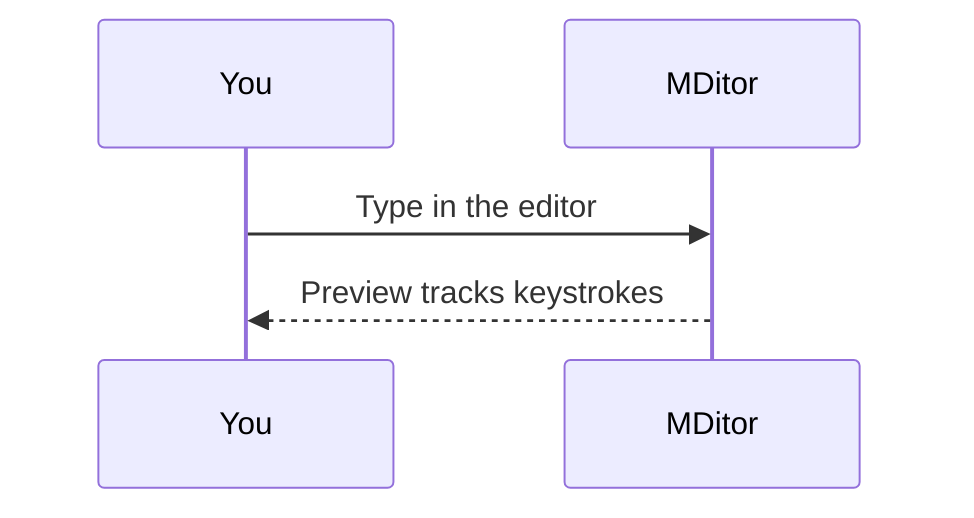

# MDitor
A split-pane markdown editor built with **native-sdk** — the document you are reading lives in the editor on the left, and everything on this side is rendered live by the native widget engine. No webview, no HTML: headings, tables, and links below are ordinary widgets.

Edit anything on the left and watch this pane keep up keystroke for keystroke.

## What works here

- **Inline styles** — bold, *italic*, `inline code`, ~~strikethrough~~, and [real links](https://ziglang.org) with a pointer cursor
- **Tables** with per-column alignment (see below)
- **Task lists**, fenced code blocks, and `> blockquotes`
- **Collapsible `<details>` sections** whose state lives in the app model, not the renderer
- **LaTeX math** — inline $x^2 + y^2 = z^2$ and display blocks with real fractions and roots
- **Mermaid diagrams** — flowcharts, sequence diagrams, and pie charts from fenced blocks
- Bare URLs autolink too: https://github.com

## Math

Inline math runs in the text: $E = mc^2$, or $\alpha + \beta \le \gamma$. Display math composes real widgets — a fraction is a stacked numerator and denominator over a rule:

$$
\frac{-b \pm \sqrt{b^2 - 4ac}}{2a}
$$

$$
\sum_{i=1}^{n} i = \frac{n(n+1)}{2}
$$

## Diagrams





## Toolbar reference

The toolbar drives real file I/O through bounded effects — no hidden threads, no native dialogs, just an honest path field.

| Button  | What it does                                  | Effect          |
| :------ | :-------------------------------------------- | --------------: |
| Open    | Reads the file named in the path field        |  `fx.readFile`  |
| Save    | Writes the editor back to the opened file     |  `fx.writeFile` |
| Save As | Writes to the path field, adopts it as current |  `fx.writeFile` |

> Files you open or save land in the **Recent** list in the sidebar, which itself persists across launches through the same file effects.

## Try it

1. Type in the editor — the word count in the status bar updates as you go
2. Click a link in this pane — it opens in your browser
3. Press the theme toggle — both panes re-render with the dark palette

```zig
// The entire preview is one markup element:
// <markdown source="{document}" on-link="open_url" ... />
pub fn update(model: *Model, msg: Msg, fx: *Effects) void {
    switch (msg) {
        .edit => |edit| model.editor.apply(edit),
        // ...
    }
}
```

---

Select any paragraph here and copy it — selection in the preview is native, per-paragraph, and free.
